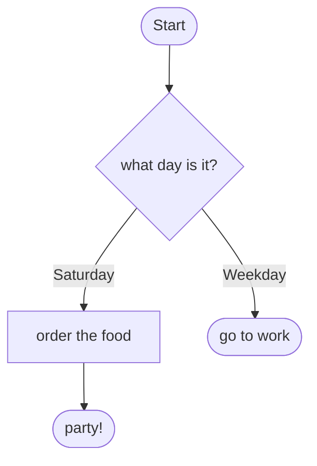

# Mermaid → Ruby scaffold generator — design

> **Status:** design agreed 2026-06-29, awaiting final review before an implementation plan.
> This is **Spec 4** of the operations work — the inverse of `to_mermaid`. It closes the loop
> from a hand-drawn spec flowchart to a `Plumbing::Operations::Task` code skeleton.

## Why

Support staff (Stephen, Colin) draw a feature as a mermaid `flowchart TD` in Obsidian — the
same shape vocabulary our Gherkin epic specs and `Operations::Task#to_mermaid` use. This tool
turns that diagram into a ready-to-fill `Plumbing::Operations::Task` subclass, so a developer
gets the whole state/transition skeleton for free and only writes the three things a diagram
genuinely cannot carry: attribute declarations, guard logic, and action bodies. Together with
`to_mermaid` (which renders the *real* structure back out), the loop is:

> draw the flowchart → generate the skeleton → fill in attributes/guards/actions →
> `to_mermaid` regenerates the diagram, now guaranteed to match the code.

## Interface

A single opt-in authoring tool (NOT loaded at runtime — it only needs to know the DSL it
generates, not the engine):

```ruby
require "plumbing/operations/generator"

ruby_source = Plumbing::Operations::Generator.from_mermaid(mermaid_string, class_name: "PlanAParty")
# => a String of Ruby source; the caller writes it wherever it likes
```

`class_name:` is required. The result is a string (no file writing, no CLI in v1 — both are
trivial to add later).

## Data flow

```
mermaid text → Parser → model (Nodes + Edges) → Emitter → Ruby source string
```

The generator has no dependency on the operations runtime — it is pure text-in / text-out.

## Parsing (line-based)

Our mermaid subset is line-oriented, so a small set of regexes suffices (no grammar, no
external gem — consistent with Plumbing's dependency-light ethos).

Each meaningful line is one of:

- the header `flowchart TD` (ignored)
- a **node** with a shape, optionally with an edge appended on the same line (matching
  `to_mermaid`'s combined form): `id["label"]`, `id{"label"}`, `id{{"label"}}`,
  `id(["label"])`, optionally followed by ` --> target` or ` -->|edge label| target`
- a **standalone edge**: `from --> to` or `from -->|edge label| to`
- the **start marker** `start([Start])` and its edge `start([Start]) --> first`
- blank lines, `flowchart …`, and `%% …` comments (including Obsidian's
  `%% mermaid-flow:pos` plugin lines) — all ignored

Intermediate model:

```ruby
Node  = Struct.new(:id, :kind, :label)        # kind: :action|:decision|:wait|:result
Edge  = Struct.new(:from, :to, :label)        # label nil = unlabelled ("else"/then)
```

**Kind from shape** (the node id is the state name, per the agreed authoring contract; the
quoted label is prose):

| shape | kind |
|---|---|
| `id["…"]` | `:action` |
| `id{"…"}` | `:decision` |
| `id{{"…"}}` | `:wait` |
| `id(["…"])` | `:result` |
| `start([Start])` / id `start` / label `Start` | start marker (not a state) |

## Emitting

`starts_with` first, then one declaration per node in **the order each node's shape line
appears** in the source. The quoted label becomes a doc comment above the declaration.

| kind | emits |
|---|---|
| action | `# label`<br>`action(:id) { raise NotImplementedError }.then :target` |
| decision | `# label`<br>`decision :id do` … one `go_to` per edge … `end` |
| wait | `# label`<br>`wait_until :id do` … `go_to`s … `end` |
| result | `result :id` |

**Edges → transitions**, mirroring `to_mermaid`'s guarded-vs-else convention:

- **labelled** edge `a -->|Saturday| b` → `go_to :b, "Saturday", if: -> { raise NotImplementedError }`
- **unlabelled** edge `a --> b` → `go_to :b` (the guardless "else"); for an action it is the
  single `.then :b`.

**Start** comes from the `start([Start]) --> first` edge → `starts_with :first` (the marker is
never emitted as a state). If no Start marker is present, the start is inferred as the node with
no inbound edges.

**Attributes** can't be inferred, so a placeholder block sits at the top:
`# TODO: declare attributes, e.g. attribute :name, String`.

The output begins with a header comment noting it was generated and should be run through
`standardrb --fix` (output is idiomatic but not guaranteed StandardRB-perfect).

### Worked example

Input:



`Plumbing::Operations::Generator.from_mermaid(input, class_name: "PlanAParty")` →

```ruby
# Generated from a mermaid flowchart. Fill in the attributes, guard bodies and
# action bodies (marked `raise NotImplementedError`), then run `standardrb --fix`.
class PlanAParty < Plumbing::Operations::Task
  # TODO: declare attributes, e.g. attribute :name, String

  starts_with :what_day

  # what day is it?
  decision :what_day do
    go_to :buy_food, "Saturday", if: -> { raise NotImplementedError }
    go_to :go_to_work, "Weekday", if: -> { raise NotImplementedError }
  end

  # order the food
  action(:buy_food) { raise NotImplementedError }.then :party

  result :party
  result :go_to_work
end
```

## Validation

Clear errors beat silently-wrong scaffolds. The generator raises
`Plumbing::Operations::Generator::Error` (a `StandardError` subclass) with a specific message
for:

- an **action** with other than exactly one outgoing edge ("action :id has N transitions —
  actions take one; use a decision/wait shape")
- a **decision/wait** with zero outgoing edges
- an edge whose **target node is never defined** with a shape (lists the id)
- a non-blank, non-comment, non-`flowchart` line that **matches no pattern** (with line number
  and text)
- a missing start (no Start marker and no node without inbound edges, or more than one such node)

Edge cases:

- the `([Start])` marker is recognised by id `start` / label `Start` and only fixes
  `starts_with`; any other `([…])` node is a result.
- an action edge carrying a label drops the label (actions take no edge label) and appends a
  `# (edge label "X" dropped)` note.

## Testing

Three layers:

1. **Parser units** — each shape → correct kind; combined shape+edge line; standalone edges;
   labelled vs unlabelled; the Start marker; comments/blank lines ignored; each malformed case
   raises the right error.
2. **Emitter units** — each kind emits the right declaration; guarded (`if:`) vs else `go_to`;
   the attributes placeholder; the class header; ordering (`starts_with` first, then nodes in
   shape-line order).
3. **Round-trip (the strong one)** — `src = from_mermaid(input, class_name: "RT")`, `eval(src)`,
   then assert `RT.to_mermaid` reproduces the input's structure. This works because `to_mermaid`
   reads only structure, never the `raise NotImplementedError` bodies — so the full
   diagram → code → diagram loop is verified end to end.

## File layout

```
lib/plumbing/operations/generator.rb   # Plumbing::Operations::Generator — from_mermaid + Error
                                        #   (Parser + Emitter may split into generator/ if they grow)
spec/plumbing/operations/generator_spec.rb
```

Opt-in: `require "plumbing/operations/generator"` (it requires nothing from the runtime). Not
added to `lib/plumbing/operations.rb`.

## Out of scope (v1)

- A `bin/` CLI or file-writing wrapper (trivial to add on top of the string API).
- Inferring attributes, guard logic, or action bodies (impossible from a diagram — that's the
  whole point of the placeholders).
- Full mermaid syntax beyond the documented operations shape vocabulary.
