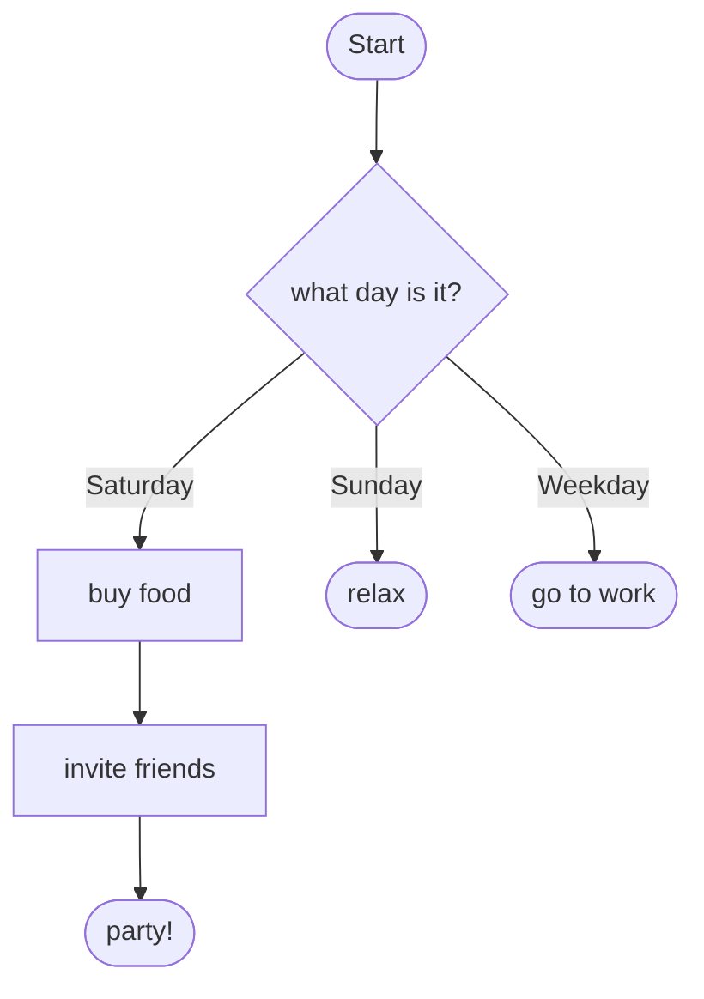

# Plumbing::Operations — design

> **Status:** design agreed 2026-06-29, awaiting final review before an implementation plan.
> **Scope:** this document specifies **Spec 1** (the core). Specs 2–4 are deliberate
> follow-ons, described under [Decomposition](#decomposition) but not designed here.

## Why

When we add a feature to a complex app we tend to draw a flowchart: "start here, check
this, if true do that, otherwise do the other, wait for the user, then finish." That
flowchart is a state machine with **action**, **decision**, **wait** and **result**
states. The `standard-procedure/operations` gem already models this well, but it is
Rails-bound: it persists every task to an `operations_tasks` row via ActiveRecord and
relies on an ActiveJob background processor (`wake_sleeping` / `Runner`) to re-poll
sleeping waits.

Now that Plumbing has **actors** (a sequential, single-consumer message loop) and a
composable **event stream** (`Pipeline` + `Event`), we can rebuild the same idea without
the Rails machinery:

- the **actor's own loop** replaces the background processor — a wait schedules a delayed
  self-message instead of sleeping in a DB row;
- **persistence becomes just another observer** of an event stream the operation emits to;
- the operation can render **mermaid** of itself, which is the *same* notation our Gherkin
  epic specs use — so an operation's diagram can be the spec's diagram.

## Decomposition

This is more than one spec. The seams are clean, so we split honestly:

- **Spec 1 — the core (this document).** Includes a small, foundational addition to the
  **actor worker contract** (`after` / `cancel_deferred`, see
  [Deferral as a worker capability](#deferral-as-a-worker-capability)), then the
  `Plumbing::Operations::Task` engine (action / decision / wait / result / interaction,
  `delay`/`timeout`, the non-blocking loop), context as Literal-typed attributes, the
  class-method DSL, event emission to an optional pipeline + the `restore` seam, and
  `to_mermaid`.
- **Spec 2 — data-driven front-end.** A subclass that builds the *same* internal state
  representation from a data file. Format-agnostic (JSON / YAML / DB row all just build the
  representation). Purely additive.
- **Spec 3 — a persistence adapter.** A concrete event-stream subscriber (likely
  ActiveRecord, to give the `operations` gem a migration path) plus its `restore`. A
  **separate, application-specific gem** so Plumbing stays Rails-free.
- **Spec 4 — a mermaid→Ruby scaffold generator.** Reads a mermaid flowchart and emits a
  `Plumbing::Operations::Task` subclass with placeholders for everything the diagram can't
  carry (attributes, guards, action bodies). The inverse of `to_mermaid`; closes the loop
  from spec diagram to code skeleton.

Specs 2–4 depend on Spec 1's internal representation and on the **documented mermaid
subset** that `to_mermaid` emits (Spec 4 parses that subset; keep it regular).

## Internal model

The foundational decision: keep the readable `operations` DSL vocabulary, but **compile
every declaration into one unified, type-safe node structure** that the engine and the
mermaid renderer both read. (Alternatives considered: distinct classes per state type —
spreads loop logic across four shapes; or a unified node exposed directly in the DSL —
loses vocabulary the author finds meaningful. The hybrid keeps authoring familiar and the
engine trivial.)

Since we already use Literal, the representation is `Literal::Data`:

```ruby
module Plumbing::Operations
  class Transition < Literal::Data
    prop :guard,  _Callable?            # nil = unconditional ("else") branch
    prop :target, Symbol                # next state
    prop :label,  _Nilable(String)      # edge text for mermaid (author-supplied)
  end

  class WaitOptions < Literal::Data
    prop :delay,   _Float, default: 10.0        # poll interval, seconds
    prop :timeout, _Float, default: 86_400.0    # seconds (24h)
  end

  class State < Literal::Data
    prop :name,         Symbol
    prop :kind,         Plumbing.OneOf(:action, :decision, :wait, :result)
    prop :action,       _Callable?
    prop :transitions,  _Array(Transition), default: [].freeze
    prop :wait_options, _Nilable(WaitOptions)
  end
end
```

- **action** = a state with an `action` callable and exactly one (unconditional) transition.
- **decision** = no action; ≥1 guarded transitions evaluated immediately.
- **wait** = like decision, but if no guard matches it reschedules instead of failing; has a
  `wait_options`.
- **result** = no action, no transitions (terminal).

Durations are stored as `Float` seconds; the DSL coerces `15.minutes`-style values via
`to_f` at the boundary, so core stays Rails-free.

## DSL

De-Railsed `operations` vocabulary. `attribute` (Literal-typed) replaces
`has_attribute`/`has_model`; `go_to` carries an edge label.

```ruby
class PlanAParty < Plumbing::Operations::Task
  attribute :date, Date                       # required — Literal raises if missing/nil
  attribute :available_friends, _Array(Friend), default: -> { [] }

  starts_with :what_day_is_it?

  decision :what_day_is_it? do
    go_to :buy_food,   "Saturday", if: -> { date.saturday? }
    go_to :relax,      "Sunday",   if: -> { date.sunday? }
    go_to :go_to_work, "Weekday"                # guardless = the "else" branch
  end

  action(:buy_food) { food_shop.order_party_food }.then :invite_friends
  action(:invite_friends) { self.available_friends = friends.select { _1.available_on?(date) } }.then :party!

  result :party!
  result :relax
  result :go_to_work
end
```

Wait/interaction example, showing per-wait overrides and class-level defaults:

```ruby
class UserRegistration < Plumbing::Operations::Task
  attribute :email, String
  attribute :name, _Nilable(String)
  attribute :user, _Nilable(User)

  delay 10.seconds        # class-wide default poll interval (coerced to_f)
  timeout 24.hours        # class-wide default

  starts_with :send_invitation

  action(:send_invitation) { UserMailer.with(email:).invitation.deliver_later }.then :name_provided?

  wait_until :name_provided?, delay: 15.minutes, timeout: 7.days do
    go_to :create_user, "name supplied", if: -> { name.present? }
  end

  interaction(:register!) { |name:| self.name = name }.when :name_provided?

  action(:create_user) { self.user = User.create!(name:) }.then :done

  result :done
end
```

## Deferral as a worker capability

Rather than the Operation reaching for `Async` directly, **deferred messaging becomes part
of the actor worker contract**, so an operation works with *any* worker — including ones not
yet written:

```ruby
id = actor.after(seconds, call: :method, **params)   # worker delivers it later; returns an id
actor.cancel_deferred(id)
```

`after` builds the same message `post` would, but the worker delivers it later by its own
mechanism and returns an opaque **id**. `cancel_deferred(id)` asks the worker to drop it,
implemented as a **no-op flag** so a deferred message that fires concurrently with the
cancel simply does nothing (race-safe). Per worker:

- **inline** — raises `NotSupported`: there is no loop to deliver a later message. This is
  precisely why wait-bearing operations need a real worker.
- **async** — a transient `Async` task that sleeps then dispatches; cancel stops the task /
  sets the no-op flag.
- **threaded** — a timer thread that sleeps then enqueues; cancel sets the no-op flag.
- **rails** (future) — `ActiveJob.set(wait:).perform_later`, which would make the deferral
  **durable** — a natural bridge back to the gem's background-processor behaviour, for free.

Because workers are frozen `Literal::Data`, the pending-deferral registry lives in a mutable
container prop, the way `Threaded` already holds its queue/thread. This capability is
generally useful (timeouts, retries, debounced actor work), not Operation-specific.

## Runtime — the actor loop

The engine is a single private `_advance` message the operation posts to **itself**, so
every step runs sequentially in the actor's own context. State is never mutated from
outside.

`call(**attrs)` (alias `perform_now`) validates and sets attributes, emits `Started`,
enters `starts_with`, and posts the first `_advance`. Each `_advance` dispatches on the
current state's `kind`:

- **`:action`** — run the action callable; take its single transition; emit `Transitioned`;
  post `_advance`.
- **`:decision`** — evaluate guards in order; first match transitions + `_advance`; if none
  match and there is no guardless default, fail with `NoDecision`.
- **`:wait`** — evaluate guards. Match → transition + `_advance`. No match → emit `Waiting`
  and schedule (see below).
- **`:result`** — emit `Completed`; mark `completed?`; stop.

### The wait loop

On entering a wait the operation schedules two deferred calls via the worker and remembers
their ids: a **poll** — `after(delay, call: :_advance, token:)` — and a **timeout** —
`after(timeout, call: :_timeout)`:

- Poll fires, guard still false → reschedule the poll (new id, new token); the timeout keeps
  running (timeout is measured from entry, not reset by polls or interactions).
- Guard satisfied (a poll *or* an interaction re-evaluates it) → transition, then
  `cancel_deferred` both ids.
- Timeout fires → fail with `Timeout`.

`cancel_deferred` plus the worker's no-op flag does the heavy lifting for stale timers. The
one race it cannot catch — a poll message already enqueued at the instant we cancel — is
covered by a **small generation token** carried on the poll: `_advance` ignores a poll whose
token is no longer current. Net: one live poll per wait; stale fires self-cancel.

This makes the operation **worker-agnostic**: it never names `Async`. Wait-bearing
operations simply require a worker whose `after` is supported (async, threaded, or a future
durable one); declaring `wait_until` on an inline operation raises a clear configuration
error.

### Interactions

`interaction(:name) { |...| ... }.when :state` defines a public async method. After running
its body it posts `_advance`, so the current wait re-evaluates immediately. Calling it in any
state other than its `.when` guard raises `InvalidState` to the caller; the operation's state
is unchanged.

### Failure

Any action or guard raising → the operation catches it, stores `exception`, emits `Failed`,
marks `failed?`, stops. `Timeout` and `NoDecision` are the two engine-raised failures.

### Caller interface

`current_state`, `in?(:name)`, `completed?`, `failed?` are await-able queries. For a result
value, callers `await { op.call(...) }` on inline, or await completion on async, leaning on
the existing `Awaitable` marker.

## Attributes (context)

Declared Literal-typed; Literal's nil-handling gives presence-validation for free.

```ruby
attribute :date, Date                       # required
attribute :name, _Nilable(String)           # optional
attribute :available_friends, _Array(Friend), default: -> { [] }
```

Held internally in a generated `Literal::Struct`, surfaced as typed reader/writer methods so
handlers read naturally (`self.name = …`, `date.saturday?`). Mutations happen inside actions,
in the actor's own context, so they are sequential and safe. `attributes` returns the
struct's `to_h` — what events and restore need. Business rules beyond types are out of scope
for v1 (model them as an early decision state); a `validate {}` hook is a later option.

## Events & the restore seam

The operation emits registered `Plumbing::Event`s to an **optional** pipeline passed at
`call`:

```ruby
MyOp.call(pipeline: audit_pipeline, date: Date.today)   # omit pipeline → null sink
```

Event set (small, registered under `Plumbing::Operations`):

- `Started` — created, at its starting state
- `Transitioned(from:, to:, via:)` — after a transition commits
- `Waiting(state:, until:)` — entered/re-polled a wait
- `Completed(state:)` / `Failed(state:, exception:)`

Each checkpoint event carries a **full snapshot**: `{operation_id, state, attributes}`.
Attributes only change inside an action, and every action ends in a transition, so
snapshotting on `Transitioned` captures every meaningful change at the persistence-relevant
moments. The persistence handler (Spec 3) becomes a one-liner: upsert
`(operation_id, state, attributes)`. (Heavier than necessary for very large contexts, but
matches what the gem already does — write the whole row per transition — and makes restore
trivial.) Events are emitted **after** the in-memory transition commits, so an observer that
dies mid-write cannot desync the operation from its log.

**Restore** is one generic class method in core; only *calling it with the right data* is
adapter-specific:

```ruby
MyOp.restore(state: "name_provided?", pipeline: p, wait_started_at: t, **saved_attributes)
```

It rebuilds the operation already positioned at `state` with those attributes and resumes the
loop. On restoring into a wait, it reschedules the poll `after(delay)` and the timeout
`after(timeout - elapsed)`, where `elapsed` derives from the persisted `wait_started_at` — so
the timeout survives a crash. Core exposes the parameter; the adapter decides whether to use
it.

This is the entire durability story: the pipeline *is* the log, persistence is a subscriber,
restore reduces to "set attributes + state, resume."

## Mermaid

`to_mermaid` is a **pure function of the `State` structure** — no runtime needed; works on
the class (the shape) and optionally highlights `current_state` on a live instance. Output is
`flowchart TD`, using the **same shape vocabulary as our Gherkin epic spec flowcharts**:

| kind | shape | mermaid |
|---|---|---|
| start | terminal | `([Start])` |
| action | rectangle | `state["label"]` |
| decision | diamond | `state{"label"}` |
| wait | hexagon | `state{{"label"}}` |
| result | terminal | `state(["label"])` |

**The condition-label problem.** A guard is a proc; there is no honest way to render
`-> { date.saturday? }` as edge text. Hence the author-supplied label on `go_to`: the *edge
text is human-supplied, the structure is real*. Each transition renders as
`from -->|label| to`; a guardless default renders `-->|else|`; an `action.then` with no label
renders a bare `-->`.



Because the engine renders from the *real* states and transitions, the diagram is
**structurally guaranteed accurate** — every node and edge exists in code; only the edge text
is human-supplied. This is the natural seam where the `@covers:<id>` linker (from the Gherkin
spec-flowchart work) would later bind a transition to its EARS criterion.

The emitted format is a **documented, regular subset** of mermaid flowchart syntax so that
Spec 4's generator can parse it for the reverse direction.

## Testing

Mirror the gem's best feature: a `test(:state, **attrs)` helper that builds an operation
positioned at one state and fires just that handler, so each decision/action/wait is
unit-testable in isolation without driving the whole flow. Plus full-flow tests on inline
operations, and time-controlled tests for waits/timeouts on the async worker. TDD throughout
(red → green → refactor), StandardRB clean.

## Proposed file layout

```
# Actor worker contract — modified to add deferred messaging
lib/plumbing/actor/worker.rb           # + after / cancel_deferred (base contract)
lib/plumbing/actor/inline.rb           # after → NotSupported
lib/plumbing/actor/async.rb            # after → Async task + cancel
lib/plumbing/actor/threaded.rb         # after → timer thread + cancel

# The operation
lib/plumbing/operations.rb             # namespace + event registration
lib/plumbing/operations/task.rb        # Plumbing::Operations::Task — the Actor base class
lib/plumbing/operations/dsl.rb         # class-method declarations → build States
lib/plumbing/operations/state.rb       # State (Literal::Data)
lib/plumbing/operations/transition.rb  # Transition (Literal::Data)
lib/plumbing/operations/wait_options.rb# WaitOptions (Literal::Data)
lib/plumbing/operations/machine.rb     # the _advance loop, waits, timeout, failure
lib/plumbing/operations/attributes.rb  # the generated Literal::Struct + accessors
lib/plumbing/operations/events.rb      # registered Plumbing::Event subclasses
lib/plumbing/operations/mermaid.rb     # to_mermaid renderer
```

## Open questions / deferred

- **Base class name.** `Plumbing::Operations::Task` (mirrors the old gem, eases migration)
  vs `Plumbing::Operation` singular. Current choice: `Plumbing::Operations::Task`.
- **Worker default for wait-bearing operations.** Require an explicit `uses :async`/
  `:threaded` and raise if a `wait_until` is declared on an inline operation (current
  choice), vs implicitly switching the worker.
- **Durable deferral via the rails worker.** `after` on a future rails worker backed by
  `ActiveJob.set(wait:)` would survive restarts — revisit alongside Spec 3.
- **Sub-tasks** (the gem's `start`/`sub_tasks` associations) — out of Spec 1; likely
  operations spawning child operations and waiting on their `Completed` events.
- **`validate {}` hook** for business rules beyond Literal types — deferred.
- **Mermaid grammar** — pin the exact emitted subset when implementing `to_mermaid`, since
  Spec 4 depends on it.
```
